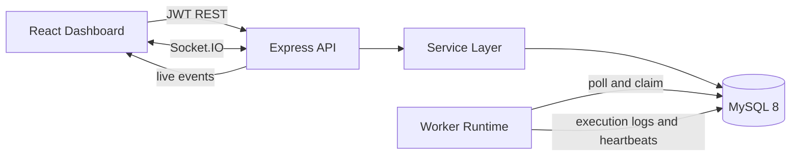
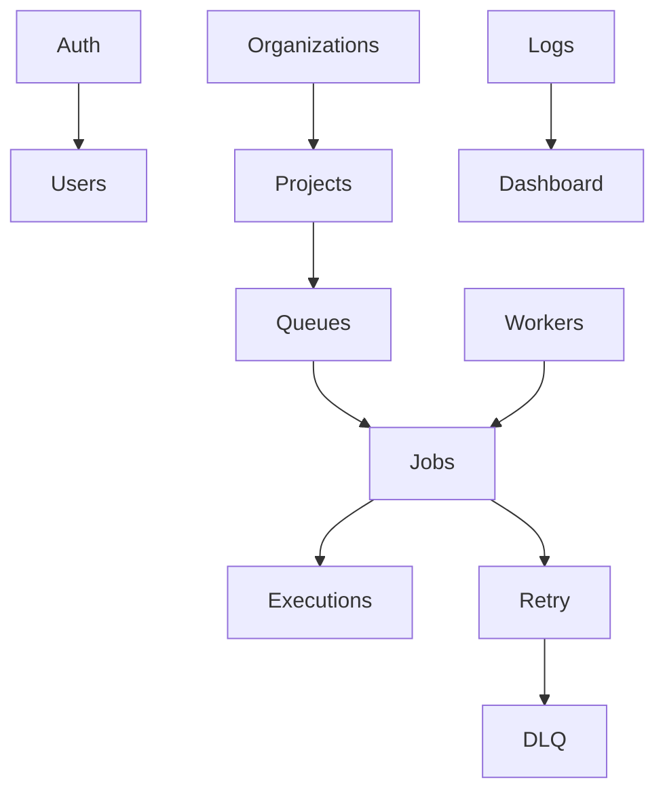
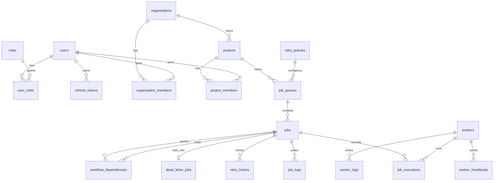
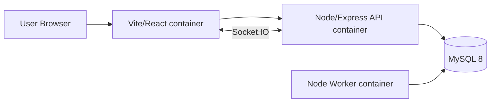

# Architecture Diagram



# Modular Backend



# ER Diagram



# Atomic Claim Sequence

```mermaid
sequenceDiagram
  participant W1 as Worker A
  participant W2 as Worker B
  participant DB as MySQL
  W1->>DB: BEGIN; lock queue row FOR UPDATE
  W1->>DB: SELECT eligible jobs FOR UPDATE SKIP LOCKED
  W2->>DB: SELECT eligible jobs FOR UPDATE SKIP LOCKED
  DB-->>W2: skips rows locked by Worker A
  W1->>DB: UPDATE jobs SET status=CLAIMED, worker_id=A
  W1->>DB: INSERT job_executions
  W1->>DB: COMMIT
```

# Deployment Diagram


